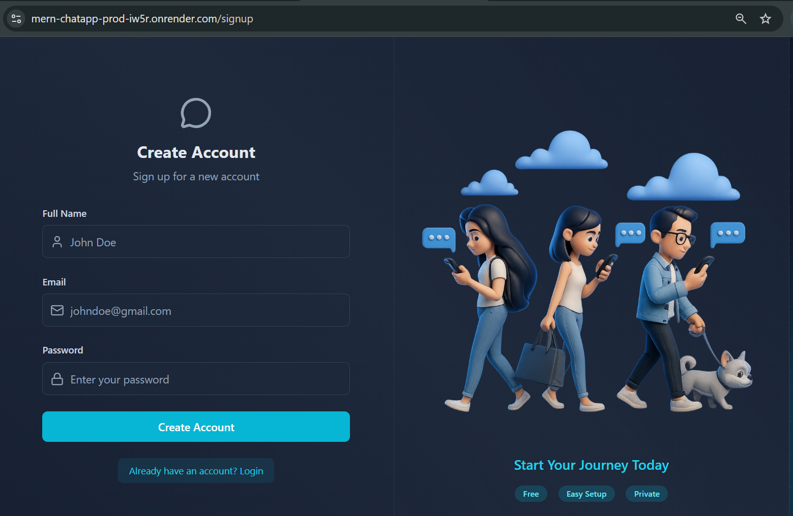
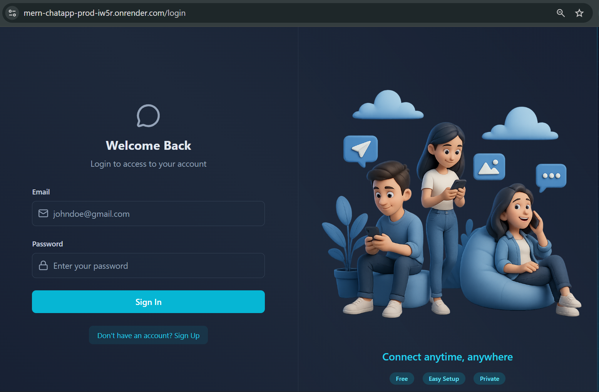
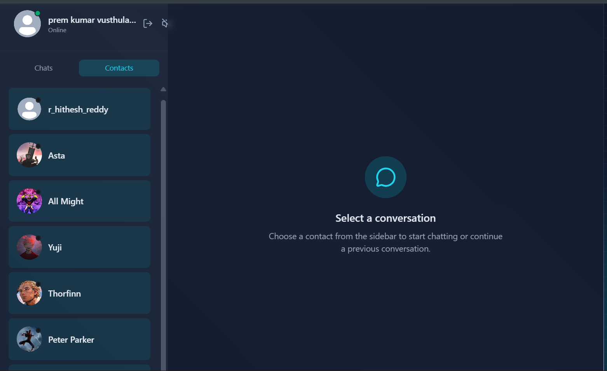

# MERN Real-Time Chat Application

A full-stack real-time chat application built using the MERN stack (MongoDB, Express.js, React, Node.js).  
The application enables secure authentication and instant messaging between users using WebSockets (Socket.IO) with persistent chat history stored in MongoDB.

---

## 🔗 Live Demo
https://mern-chatapp-prod-iw5r.onrender.com/

---

## 🧩 Features

### Authentication
- User registration and login
- JWT-based authentication
- Protected API routes

### Real-Time Messaging
- Instant messaging using Socket.IO (WebSockets)
- Online / offline user status
- Typing indicators

### Chat Functionality
- One-to-one private conversations
- Persistent chat history (MongoDB)
- Message timestamps

### Media Sharing
- Send images/files
- Cloudinary media storage integration

### User Interface
- Responsive UI (mobile + desktop)
- Built using React, Tailwind CSS and DaisyUI
- Global state management using Zustand

---

## 🛠 Tech Stack

**Frontend**
- React
- Tailwind CSS
- DaisyUI
- Zustand

**Backend**
- Node.js
- Express.js
- Socket.IO

**Database**
- MongoDB (MongoDB Atlas)

**Services & Tools**
- Cloudinary – media storage  
- Resend – email service  
- Arcjet – API rate limiting & security

---

## 📁 Project Structure

```
fullstack-realtime-chat-app
│
├── frontend        # React client
├── backend         # Express + Socket.IO server
└── screenshots     # Application UI images
```

---

## ⚙️ Local Setup Instructions

### 1️⃣ Clone Repository
```
git clone https://github.com/prem05012005/fullstack-realtime-chat-app
cd fullstack-realtime-chat-app
```

---

### 2️⃣ Backend Setup
```
cd backend
npm install
npm run dev
```

Create a `.env` file inside the `backend` folder:

```
PORT=3000
MONGO_URI=your_mongodb_connection_string
JWT_SECRET=your_secret_key

CLOUDINARY_CLOUD_NAME=your_cloud_name
CLOUDINARY_API_KEY=your_api_key
CLOUDINARY_API_SECRET=your_api_secret
```

---

### 3️⃣ Frontend Setup
```
cd frontend
npm install
npm run dev
```

Frontend runs on:
```
http://localhost:5173
```

---

## 📸 Application Screenshots

### Register Page


### Login Page


### Contacts / Users List


### Start Conversation


### Real-Time Messaging


### Media Sharing


---

## 🚀 Key Concepts Demonstrated
- REST API development
- JWT Authentication
- WebSocket communication
- Real-time event handling
- Database persistence
- Frontend state management

---

## 👤 Author
**Premkumar Vusthulamuri**  
GitHub: https://github.com/prem05012005
